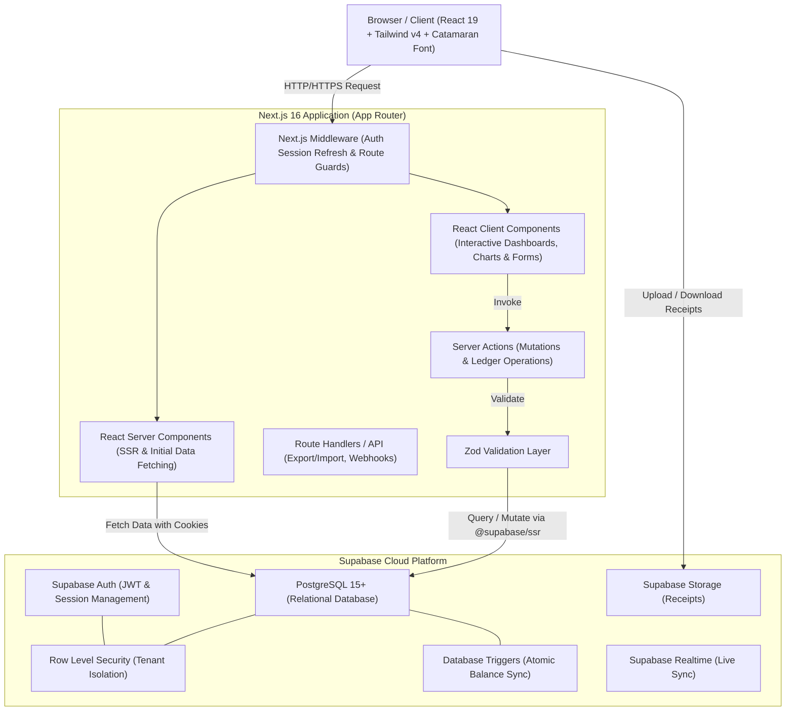

# System Architecture & Technical Specification
## Cashone — Personal Finance & Cashflow Tracker

**Tech Stack:** Next.js 16 (App Router), React 19, TypeScript, Tailwind CSS v4, Supabase (PostgreSQL 15+, Auth, RLS, Storage)  
**Target Environment:** Vercel (Next.js Edge & Serverless Runtime) + Supabase Cloud  
**Document Version:** 2.0.0  

---

## 1. High-Level Architecture Overview



---

## 2. Directory & Application Structure

```text
cashone/
├── app/
│   ├── (auth)/
│   │   ├── login/page.tsx
│   │   ├── register/page.tsx
│   │   └── layout.tsx
│   ├── (dashboard)/
│   │   ├── layout.tsx              # Sidebar, Topbar, User profile
│   │   ├── page.tsx                # Main Executive Overview Dashboard
│   │   ├── accounts/page.tsx       # Accounts list & management
│   │   ├── transactions/page.tsx   # Ledger table, filter, export
│   │   ├── categories/page.tsx     # Category & budget limits
│   │   ├── analytics/page.tsx      # Inflow/outflow reports
│   │   └── settings/page.tsx       # Preferences, currencies, backups
│   ├── api/
│   │   └── export/route.ts         # CSV / JSON export
│   ├── globals.css
│   └── layout.tsx
├── components/
│   ├── ui/                         # Base design system (Button, Card, Dialog, Table, Tabs, Badge, Input)
│   ├── dashboard/                  # KPI Metric cards, Cashflow charts, Category breakdown
│   ├── ledger/                     # TransactionFormDialog, TransactionTable
│   ├── accounts/                   # AccountCard, AccountDialog, AccountsHeader
│   ├── categories/                 # CategoryDialog, CategoriesHeader
│   └── layout/                     # Sidebar, Navbar
├── lib/
│   ├── supabase/                   # client.ts, server.ts, middleware.ts
│   ├── actions/                    # accounts.actions.ts, transactions.actions.ts, categories.actions.ts, storage.actions.ts
│   ├── validations/                # account.schema.ts, transaction.schema.ts, category.schema.ts
│   └── utils.ts
├── types/
│   └── database.types.ts
└── doc/
```
