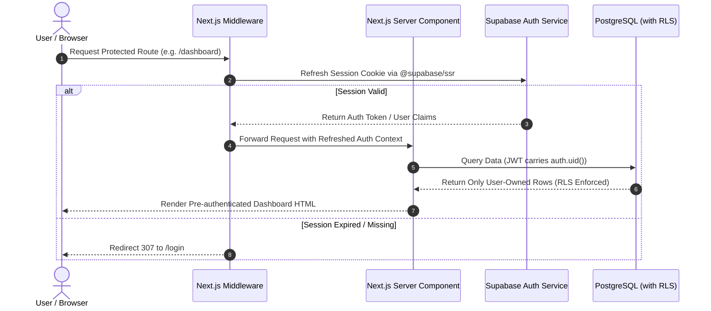

# Security, Authentication & Authorization Protocol
## Cashone — Supabase Auth & Next.js Security Architecture

This document specifies the authentication lifecycle, session synchronization via Next.js middleware, Zero-Trust Row Level Security (RLS) enforcement, rate limiting, and asset security.

---

## 1. Authentication Architecture & Flow



---

## 2. Next.js Middleware Authentication Handler

The middleware (`middleware.ts`) ensures that session tokens are automatically refreshed and kept synchronized between server cookies and Supabase Auth.

```typescript
// middleware.ts
import { createServerClient } from '@supabase/ssr';
import { NextResponse, type NextRequest } from 'next/server';

export async function middleware(request: NextRequest) {
  let supabaseResponse = NextResponse.next({ request });

  const supabase = createServerClient(
    process.env.NEXT_PUBLIC_SUPABASE_URL!,
    process.env.NEXT_PUBLIC_SUPABASE_ANON_KEY!,
    {
      cookies: {
        getAll() {
          return request.cookies.getAll();
        },
        setAll(cookiesToSet) {
          cookiesToSet.forEach(({ name, value, options }) => request.cookies.set(name, value));
          supabaseResponse = NextResponse.next({ request });
          cookiesToSet.forEach(({ name, value, options }) =>
            supabaseResponse.cookies.set(name, value, options)
          );
        },
      },
    }
  );

  const { data: { user } } = await supabase.auth.getUser();

  const isAuthRoute = request.nextUrl.pathname.startsWith('/login') || 
                      request.nextUrl.pathname.startsWith('/register');

  // If user is not authenticated and trying to access protected dashboard
  if (!user && !isAuthRoute && !request.nextUrl.pathname.startsWith('/public')) {
    const url = request.nextUrl.clone();
    url.pathname = '/login';
    url.searchParams.set('redirectTo', request.nextUrl.pathname);
    return NextResponse.redirect(url);
  }

  // If user is already logged in and visiting login/register
  if (user && isAuthRoute) {
    const url = request.nextUrl.clone();
    url.pathname = '/';
    return NextResponse.redirect(url);
  }

  return supabaseResponse;
}

export const config = {
  matcher: ['/((?!_next/static|_next/image|favicon.ico|.*\\.(?:svg|png|jpg|jpeg|gif|webp)$).*)'],
};
```

---

## 3. Data Protection & Zero-Trust Row Level Security (RLS)

### 3.1. Rules for Direct Client Operations
1. **Never use the `service_role` key on the client or in standard Server Actions.** Always use the authenticated client instance derived from cookies.
2. All database tables must have `ALTER TABLE <table> ENABLE ROW LEVEL SECURITY;`.
3. Default policy is `DENY ALL`. Specific `PERMISSIVE` policies are applied per operation (`SELECT`, `INSERT`, `UPDATE`, `DELETE`).
4. All foreign key relationships verify ownership cascading:
   * A user cannot create a transaction referencing an account belonging to another user.

```sql
-- Example Cross-User Foreign Key Guard Policy
CREATE POLICY "Prevent Cross-User Transaction Account Manipulation"
ON public.transactions
FOR INSERT TO authenticated
WITH CHECK (
    auth.uid() = user_id
    AND EXISTS (SELECT 1 FROM public.accounts WHERE id = account_id AND user_id = auth.uid())
    AND (destination_account_id IS NULL OR EXISTS (SELECT 1 FROM public.accounts WHERE id = destination_account_id AND user_id = auth.uid()))
);
```

---

## 4. Supabase Storage Security (Folder Isolation)

1. Storage files are partitioned by User UUID: `<bucket_name>/<user_id>/<file_uuid>.<ext>`.
2. Storage RLS policies block cross-user path reads and writes.
3. Media URLs are generated as time-limited signed URLs (`supabase.storage.from('receipts').createSignedUrl(path, 3600)`) for private receipts.

---

## 5. Input Sanitization & Threat Mitigation

* **SQL Injection:** Mitigated completely via Supabase PostgREST parameter binding and prepared statements.
* **XSS:** Handled natively by React's JSX string escaping; notes and text fields are strictly sanitized before rendering.
* **CSRF:** Next.js Server Actions utilize internal CSRF tokens matching the Origin and Host headers.
