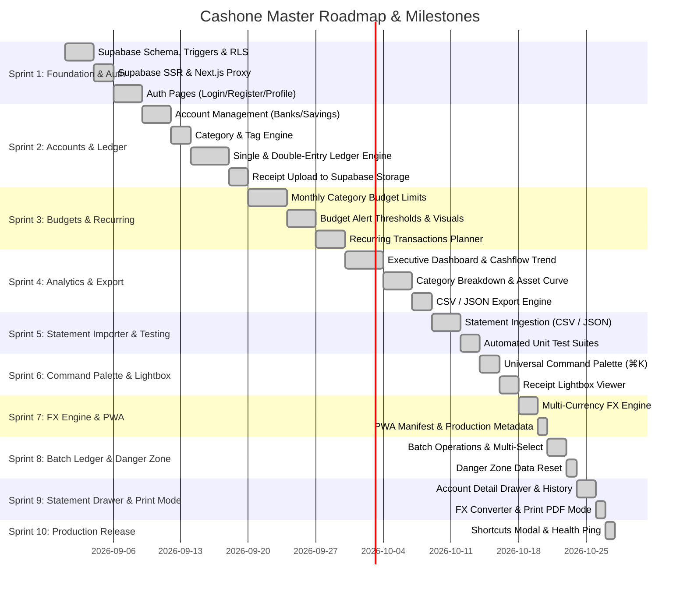

# Cashone Master Development Roadmap & Release Milestones
## Project: Cashone Personal Finance Tracker
**Methodology:** Agile / Continuous Milestone Execution  
**Fullstack Architecture:** Next.js 16 (App Router + Turbopack) + Supabase (PostgreSQL 15+, Auth, RLS, Storage)  
**UI/UX:** Vanilla CSS + Tailwind CSS + Catamaran Font + Glassmorphism  
**Deployment:** Vercel (Edge Proxy + Serverless Functions)  
**Document Version:** 5.0.0 (Production Release)  

---

## 1. Milestone Overview

---

## 2. Detailed Milestone Deliverables

### 🔷 SPRINT 1: Database Foundation, Auth & Shell UI (Completed)
* Supabase migrations with atomic balance triggers and zero-trust RLS policies.
* `@supabase/ssr` cookies handler and Next.js proxy middleware.
* Dark financial theme design tokens and Catamaran typography.
* Login & Register pages with session persistence.

### 🔷 SPRINT 2: Accounts & Multi-Currency Ledger (Completed)
* Account CRUD: Bank, High-Yield Savings, E-Wallets, Cash, and Investments.
* Category tree with system presets and custom user categories.
* Single & Double-entry Transaction Ledger with real-time balance calculations.
* Secure Receipt uploads to Supabase Storage with in-app preview lightbox.

### 🔷 SPRINT 3: Budgets & Category Spending Limits (Completed)
* Set monthly spending limits per category.
* Visual budget progress bars with amber/red threshold alerts.
* Category budget analytics against actual monthly expenses.

### 🔷 SPRINT 4: Analytics Dashboard, Export & Settings (Completed)
* Financial Analytics & Reports (`/analytics`) with period filters (7D, 30D, 3M, 6M, 1Y, All Time).
* Interactive Cashflow charts (Inflow vs Outflow over time).
* Category spending breakdown with proportion analysis.
* Liquid asset allocation across all accounts.
* CSV / JSON Transaction export engine.
* Settings & Profile Management (`/settings`) with currency selection.

### 🔷 SPRINT 5: Recurring Planner & Statement Importer (Completed)
* Recurring Transactions & Bills Planner (`/recurring`) with 1-click "Post Now" logging.
* Bank Statement Importer supporting CSV and JSON formats.
* Automated Unit Testing Suite covering transfer balance conservation, budget thresholds, savings rate math, and CSV parsing.

### 🔷 SPRINT 6: Command Palette (⌘K) & Lightbox (Completed)
* Universal Command Palette (`⌘K` / `Ctrl+K`) with keyboard navigation and page shortcuts.
* In-place account editing and balance configuration.
* Enhanced Receipt Lightbox Viewer with zoom in/out, 90° rotation, and direct downloads.

### 🔷 SPRINT 7: FX Engine, Advanced Filters & PWA (Completed)
* Multi-Currency FX Engine with consolidated net worth calculations across 8 currencies.
* Advanced multi-dimensional transaction filtering (Account, Category, Date range presets, Sort modes).
* Demo Data Seeder tool in Settings.
* PWA Web App Manifest (`manifest.json`) and complete SEO metadata.

### 🔷 SPRINT 8: Batch Operations & Danger Zone (Completed)
* Multi-select row checkboxes with floating batch action bar (Batch Delete & Export Selected).
* Category spending insights showing total volume, transaction counts, and active budget tags.
* Danger Zone in Settings with `"PURGE"` prompt to reset test data without deleting accounts.

### 🔷 SPRINT 9: Account Statement Drawer & Print Mode (Completed)
* Interactive Account Detail Drawer showing isolated account history and lifetime cashflow.
* Live FX Currency Calculator widget on the Analytics page.
* Printable Financial Report mode (`window.print()`) with `@media print` layout optimization.

### 🔷 SPRINT 10: Production Release & System Health (Completed)
* Keyboard Shortcuts Cheatsheet dialog (`?`).
* Real-time Supabase database connection and roundtrip latency health check.
* Final documentation polish and production build verification.
