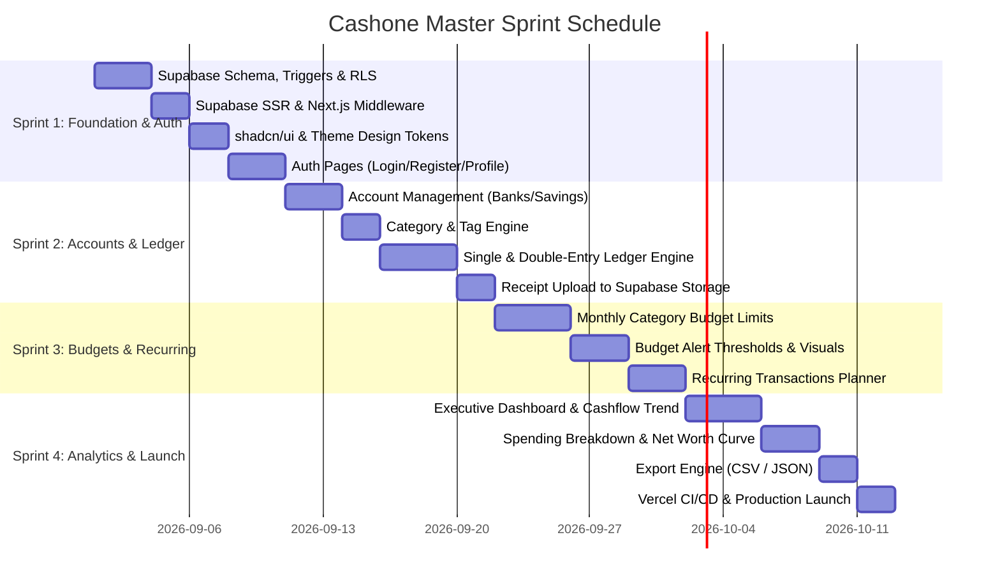

# Cashone Sprint Breakdown & Master Execution Plan
## Project: Cashone Personal Finance Tracker
**Methodology:** Agile / 2-Week Sprint Cadence  
**Fullstack Architecture:** Next.js 16 (App Router + React 19) + Supabase (PostgreSQL 15+, Auth, RLS, Storage)  
**UI/UX:** shadcn/ui + Tailwind CSS v4 + Catamaran Font  
**Deployment:** Vercel (Edge Middleware + Serverless Functions)  
**Document Version:** 3.0.0  

---

## 1. Master Sprint Schedule & Timeline

---

## 2. Detailed Sprint Work Breakdown Structure (WBS)

### 🔷 SPRINT 1: Database Foundation, Auth & Shell UI (Completed)
* Supabase migrations with atomic balance triggers and zero-trust RLS policies.
* `@supabase/ssr` cookies handler and Next.js `middleware.ts`.
* shadcn/ui dark terminal tokens and Catamaran typography.
* Login & Register pages with session persistence.

---

### 🔷 SPRINT 2: Accounts & Multi-Currency Ledger (Completed)
* Account CRUD: Bank, High-Yield Savings, E-Wallets, Cash, and Investments.
* Hierarchical Category classification with custom creation/deletion.
* Single & Double-entry Transaction Ledger with real-time balance calculations.
* Secure Receipt uploads to Supabase Storage with in-app preview lightbox.

---

### 🔷 SPRINT 3: Budgets & Category Spending Limits (Completed)
* Set monthly spending limits per category.
* Visual budget progress bars with amber/red threshold alerts.
* Category budget analytics against actual monthly expenses.

---

### 🔷 SPRINT 4: Analytics Dashboard, Export & Settings (Completed)
* Financial Analytics & Reports (`/analytics`) with period filters (7D, 30D, 3M, 6M, 1Y, All Time).
* Interactive Cashflow charts (Inflow vs Outflow over time).
* Category spending breakdown with multi-colored meters and proportion analysis.
* Liquid asset allocation across all accounts and wallet types.
* CSV / JSON Transaction export engine available across Ledger and Analytics views.
* Settings & Profile Management (`/settings`) with currency selection and security auditing.
* Dynamic live calculation of monthly cashflow, savings rate, and category distributions on the primary dashboard.
