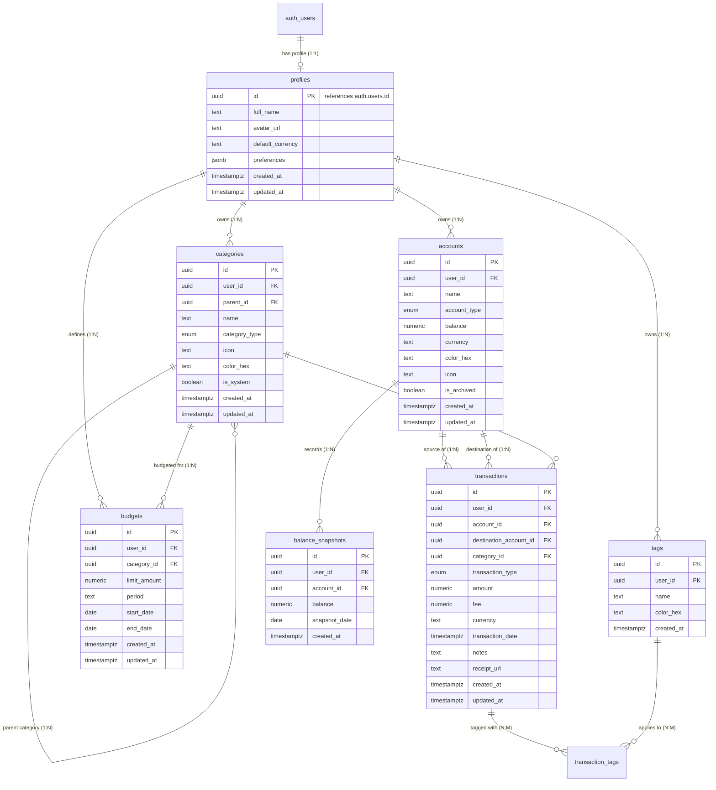

# Database Architecture PRD & Technical Specification
## Project Name: Cashone Personal Finance Tracker
**Target Platform:** Supabase (PostgreSQL 15+, Supabase Auth, Row Level Security, Supabase Storage, Realtime)  
**Document Version:** 2.0.0  
**Status:** Approved Specification  

---

## 1. Executive Summary & Architectural Goals

The **Cashone** database is designed as a secure, real-time, user-isolated relational database built on top of **Supabase / PostgreSQL**. It manages personal multi-account cash flows (income, expenses, inter-account transfers) with atomic double-entry ledger balance integrity and category budget management.

### Key Architectural Principles
1. **Multi-Tenancy & Zero-Trust Security via RLS:** Every table is secured with Row Level Security (RLS) tied directly to `auth.users.id`.
2. **Double-Entry & Automated Ledger Balance Integrity:** Account balances are dynamically and atomically maintained via database triggers on the `transactions` table.
3. **Auditability & Snapshotting:** High-frequency balance snapshots and timestamp tracking provide instantaneous analytical reporting for net worth trajectory.
4. **Receipt & Attachment Storage:** Integrated with Supabase Storage for transaction receipts, enforcing strict user-folder isolation policies.

---

## 2. Entity Relationship Diagram (ERD)



---

## 3. Data Dictionary & Detailed Schema Definition

### 3.1. Enums & Custom Types

```sql
-- Account categories
CREATE TYPE account_type AS ENUM (
    'cash',
    'bank',
    'e_wallet',
    'savings',
    'investment',
    'credit_card'
);

-- Transaction flow types
CREATE TYPE transaction_type AS ENUM (
    'income',
    'expense',
    'transfer'
);

-- Category classification
CREATE TYPE category_type AS ENUM (
    'income',
    'expense'
);
```

---

## 4. PostgreSQL Triggers & Stored Procedures

### 4.1. Auto-Profile Creation on Supabase Auth Signup
```sql
CREATE OR REPLACE FUNCTION public.handle_new_user()
RETURNS trigger
LANGUAGE plpgsql
SECURITY DEFINER SET search_path = public
AS $$
BEGIN
    INSERT INTO public.profiles (id, full_name, avatar_url, default_currency)
    VALUES (
        NEW.id,
        COALESCE(NEW.raw_user_meta_data->>'full_name', NEW.raw_user_meta_data->>'name', 'User'),
        NEW.raw_user_meta_data->>'avatar_url',
        COALESCE(NEW.raw_user_meta_data->>'default_currency', 'USD')
    )
    ON CONFLICT (id) DO NOTHING;
    RETURN NEW;
END;
$$;

CREATE TRIGGER on_auth_user_created
    AFTER INSERT ON auth.users
    FOR EACH ROW EXECUTE FUNCTION public.handle_new_user();
```

### 4.2. Atomic Account Balance Sync (Double-Entry Ledger Trigger)
```sql
CREATE OR REPLACE FUNCTION public.sync_account_balance_on_transaction()
RETURNS trigger
LANGUAGE plpgsql
SECURITY DEFINER
AS $$
BEGIN
    -- Revert previous balances on UPDATE or DELETE
    IF (TG_OP = 'UPDATE' OR TG_OP = 'DELETE') THEN
        IF OLD.type = 'income' THEN
            UPDATE public.accounts
            SET balance = balance - OLD.amount, updated_at = now()
            WHERE id = OLD.account_id;
        ELSIF OLD.type = 'expense' THEN
            UPDATE public.accounts
            SET balance = balance + (OLD.amount + OLD.fee), updated_at = now()
            WHERE id = OLD.account_id;
        ELSIF OLD.type = 'transfer' THEN
            UPDATE public.accounts
            SET balance = balance + (OLD.amount + OLD.fee), updated_at = now()
            WHERE id = OLD.account_id;
            UPDATE public.accounts
            SET balance = balance - OLD.amount, updated_at = now()
            WHERE id = OLD.destination_account_id;
        END IF;
    END IF;

    -- Apply new balances on INSERT or UPDATE
    IF (TG_OP = 'INSERT' OR TG_OP = 'UPDATE') THEN
        IF NEW.type = 'income' THEN
            UPDATE public.accounts
            SET balance = balance + NEW.amount, updated_at = now()
            WHERE id = NEW.account_id;
        ELSIF NEW.type = 'expense' THEN
            UPDATE public.accounts
            SET balance = balance - (NEW.amount + NEW.fee), updated_at = now()
            WHERE id = NEW.account_id;
        ELSIF NEW.type = 'transfer' THEN
            UPDATE public.accounts
            SET balance = balance - (NEW.amount + NEW.fee), updated_at = now()
            WHERE id = NEW.account_id;
            UPDATE public.accounts
            SET balance = balance + NEW.amount, updated_at = now()
            WHERE id = NEW.destination_account_id;
        END IF;
    END IF;

    RETURN COALESCE(NEW, OLD);
END;
$$;

CREATE TRIGGER trg_sync_transaction_balance
    AFTER INSERT OR UPDATE OR DELETE ON public.transactions
    FOR EACH ROW
    EXECUTE FUNCTION public.sync_account_balance_on_transaction();
```

---

## 5. Row Level Security (RLS) Policy Architecture

All tables strictly enable RLS:
```sql
ALTER TABLE public.profiles ENABLE ROW LEVEL SECURITY;
ALTER TABLE public.accounts ENABLE ROW LEVEL SECURITY;
ALTER TABLE public.categories ENABLE ROW LEVEL SECURITY;
ALTER TABLE public.transactions ENABLE ROW LEVEL SECURITY;
ALTER TABLE public.budgets ENABLE ROW LEVEL SECURITY;
ALTER TABLE public.tags ENABLE ROW LEVEL SECURITY;
ALTER TABLE public.transaction_tags ENABLE ROW LEVEL SECURITY;
ALTER TABLE public.balance_snapshots ENABLE ROW LEVEL SECURITY;

CREATE POLICY "Profiles viewable by owner" ON public.profiles FOR SELECT USING (auth.uid() = id);
CREATE POLICY "Profiles updatable by owner" ON public.profiles FOR UPDATE USING (auth.uid() = id);

CREATE POLICY "Accounts manageable by owner" ON public.accounts FOR ALL USING (auth.uid() = user_id) WITH CHECK (auth.uid() = user_id);

CREATE POLICY "Categories viewable by system or owner" ON public.categories FOR SELECT USING (is_system = true OR auth.uid() = user_id);
CREATE POLICY "Categories insertable by owner" ON public.categories FOR INSERT WITH CHECK (auth.uid() = user_id AND is_system = false);
CREATE POLICY "Categories updatable by owner" ON public.categories FOR UPDATE USING (auth.uid() = user_id AND is_system = false);
CREATE POLICY "Categories deletable by owner" ON public.categories FOR DELETE USING (auth.uid() = user_id AND is_system = false);

CREATE POLICY "Transactions manageable by owner" ON public.transactions FOR ALL USING (auth.uid() = user_id) WITH CHECK (auth.uid() = user_id);
CREATE POLICY "Budgets manageable by owner" ON public.budgets FOR ALL USING (auth.uid() = user_id) WITH CHECK (auth.uid() = user_id);
CREATE POLICY "Tags manageable by owner" ON public.tags FOR ALL USING (auth.uid() = user_id) WITH CHECK (auth.uid() = user_id);
CREATE POLICY "Snapshots manageable by owner" ON public.balance_snapshots FOR ALL USING (auth.uid() = user_id) WITH CHECK (auth.uid() = user_id);
```

---

## 6. Supabase Storage Architecture

* **Bucket:** `receipts` (Private, Max 10MB, mime types: `image/jpeg`, `image/png`, `application/pdf`, `image/webp`).
* **Path:** `{user_id}/{filename}`.
* **RLS Storage Policy:**
```sql
CREATE POLICY "Allow authenticated user to upload own receipts"
ON storage.objects FOR INSERT TO authenticated
WITH CHECK (
    bucket_id = 'receipts' 
    AND (storage.foldername(name))[1] = auth.uid()::text
);

CREATE POLICY "Allow user to read own receipts"
ON storage.objects FOR SELECT TO authenticated
USING (
    bucket_id = 'receipts' 
    AND (storage.foldername(name))[1] = auth.uid()::text
);
```
